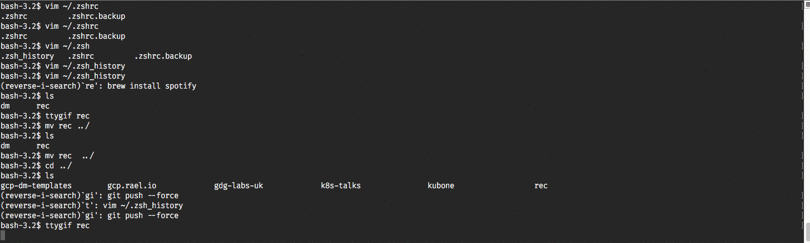

# Google Cloud Platform - Deployment Manager Templates

Repo for Deployment Manager templates shared between projects.

## Overview

The main purpose of this repo is to have a centralized template repository that
can be added to any GCP Deployment Manager project as a Git submodule.

That removes the need of copying the templates from one project to another and
the risk of ending with different versions of the templates in each project.

### Templates

Templates are organized by type of resource:

- compute
- container
- iam
- sql
- storage
- projects

The type matches the main resources of the template, as in most cases will
deploy more GCP resources required to configure / use the main one.

### The Makefile

The Makefile is useful for the actual deployments, not for managing the templates.

It expects the following folder configuration:

```
❯ tree -L 2 .
.
├── Makefile
├── deployments
│   ├── bigotes-pro
│   ├── rael-base
│   ├── rshared
│   ├── project-id-3
│   └── project-id-N
└── templates
    ├── compute
    ├── container
    ├── iam
    ├── project
    ├── sql
    └── storage
```

For each project, you can have the deployment `.yaml` manifest in the root folder
or using a similar folder hierarchy with folders per each resource type:

```
deployments/rshared
└── compute
    ├── bigotes-pro-peering.yaml
    └── network.yaml

1 directory, 2 files
```

With that setup, the makefile will generate a target to:

1. Create the deployment
2. Update the deployment
3. Preview the deployment

For example, with the following tree:

```
❯ tree deployments
deployments
├── bigotes-pro
│   └── compute
│       └── rshared-peering.yaml
├── rael-base
│   ├── compute
│   │   ├── bigotes-pro-base-peering.yaml
│   │   └── network.yaml
│   └── projects
│       ├── bigotes-pro-project.yaml
│       └── rshared-project.yaml
└── rshared
    └── compute
        ├── bigotes-pro-peering.yaml
        └── network.yaml

7 directories, 7 files
```

Will generate the following targets:

```
gcp.rael.io/dm on  master [!?] took 17s
❯ make
make target
dm-create-bigotes-pro/compute/rshared-peering          dm-preview-rael-base/compute/bigotes-pro-base-peering  dm-update-rael-base/compute/network
dm-create-rael-base/compute/bigotes-pro-base-peering   dm-preview-rael-base/compute/network                   dm-update-rael-base/projects/bigotes-pro-project
dm-create-rael-base/compute/network                    dm-preview-rael-base/projects/bigotes-pro-project      dm-update-rael-base/projects/rshared-project
dm-create-rael-base/projects/bigotes-pro-project       dm-preview-rael-base/projects/rshared-project          dm-update-rshared/compute/bigotes-pro-peering
dm-create-rael-base/projects/rshared-project           dm-preview-rshared/compute/bigotes-pro-peering         dm-update-rshared/compute/network
dm-create-rshared/compute/bigotes-pro-peering          dm-preview-rshared/compute/network                     gcloud-config-rael-base
dm-create-rshared/compute/network                      dm-update-bigotes-pro/compute/rshared-peering          help
dm-preview-bigotes-pro/compute/rshared-peering         dm-update-rael-base/compute/bigotes-pro-base-peering
```
Examples of this makefile in use:

- github.com/raelga/bigot.es
- github.com/raelga/gcp.rael.io

## Demo


